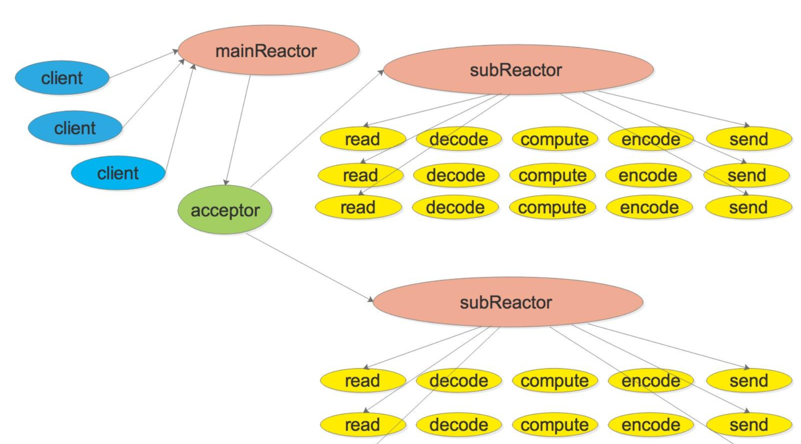
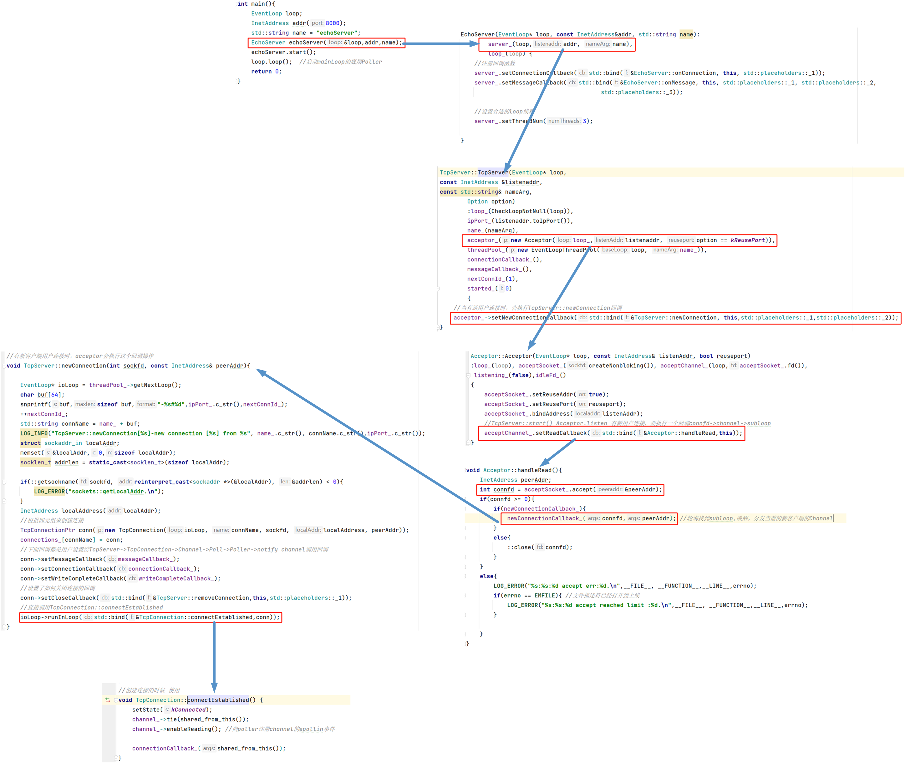
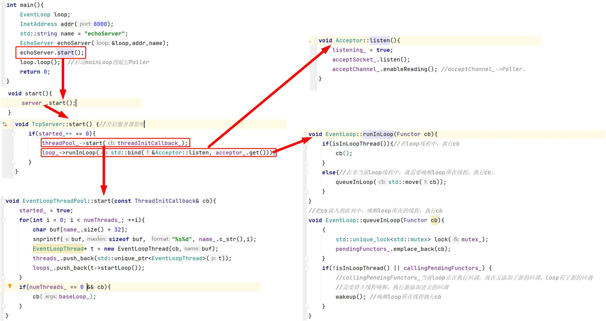
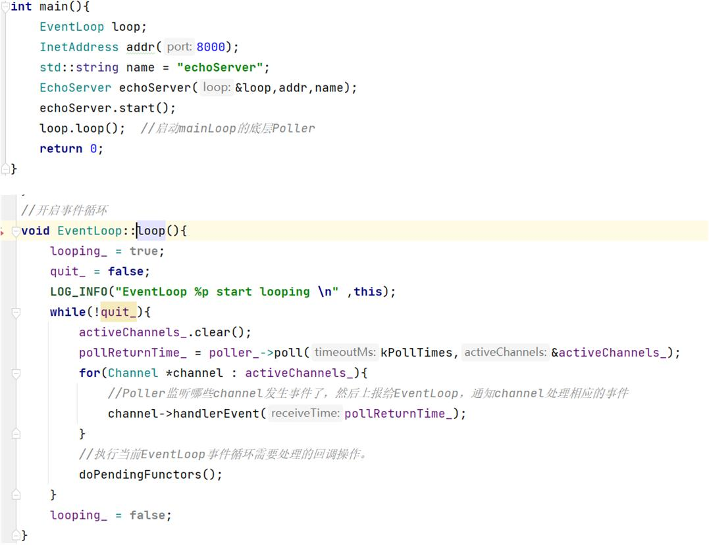

# muduo网络库梳理——学习总结

## 开发环境

- ubuntu20.04LTS
- g++ version 9.4.0
- cmake version 3.20.0

本项目用于学习，没有生成动态连接库，直接进行`cmake `和`make`生成可执行文件方便进行调试。

### 本项目与muduo库的区别

1. 使用c++11特性去除了boost库依赖，提高了其跨平台性。
2. 使用了移动语义，智能指针等c++11的特性
3. 使用c++的多线程库<thread>代替了pthread系统回调
4. 只学习并实现了muduo库中multi-Reactor的部分，对于定时器、rpc、HTTP协议等还未学习。

## one loop per thread理解

在参考muduo网络库的实现过程中，明白了one loop per thread 的含义。 loop指的就是循环，服务器不断监听事件，相应请求的一个过程。每个loop其实就是一个reactor，每个loop都有一个poller（主要使用epoll实现，用来获取监听到的事件）和多个channel，channel就是要监听的fd。

muduo网络库采用的时mutil-reactor模型，一个main-reactor和多个sub-reactor。main-reactor用来获取连接，将连接通过accepor中的connection函数下发给sub-reactor进行相应。

从网上盗了一个图可以很好的说明该模型。



## 各类作用亮点总结

### Channel

`Channel`类对文件描述符`fd`进行了封装，主要做的事情就是设置文件描述符感兴趣的事件（读、写、单端断开等事件），当监听到感兴趣的事件的时候，通过`poller`将发生的事件写到`revents`上。并可以通过不同的事件执行不同的回调。

围绕监听事件这一核心动作展开了一系列操作。比如设置监听事件，取消监听事件，看看当前事件是否监听读、写事件等等。

```c++
void Channel::handlerEvent(Timestamp receiveTime) {
    //先判断弱智能指针指向的内存还是否存在，如果存在那么就处理事件，如果内存不存在就不处理事件
    //如何判断弱智能指针指向的内存是否还存在？ 将其转换成强智能指针，看强智能指针是否为空
    std::shared_ptr<void> guard;
    if(tied_){
        guard = tie_.lock(); //如果内存还存在
        if(guard){
            handleEventWithGuard(receiveTime);
        }
    }
    else{
        handleEventWithGuard(receiveTime);  //根据相应的事件执行不同的回调操作
    }
}
```

这里有个特别亮的点就是`std::weak_ptr<void> tie_`这一个变量。在执行回调的时候，`Channel`通过`tie_`来判断`Channel`所绑定的`Connection`对象是否还存在，如果`connection`不存在了，就不执行回调操作；如果存在就执行回调。

疑问：这里connection对象和Channel对象会在不同的线程里运行吗？

### Poller/EpollPoller

在`muduo`网络库中，`Poller`主要负责监听文件描述符事件是否触发以及返回事件的文件描述符以及具体的事件，`Poller`是一个抽象类，具体实现由其子类实现，这里本次学习过程只仿写了`EpollPoller`。

`EpollPoller`继承了`Poller`，主要就是将`epoll`多路复用进行了封装。

主要属性有

- `epollfd`：使用`::epoll_create()` 创建的文件描述符，用于文件描述符上的事件。

主要动作有

- `poll`：该函数是对父类的一个继承，主要作用就是监听事件，并将监听到的事件返回。
- `updateChannel`：向epollfd上注册、修改事件。
- `removeChannel`:将在`epollfd`上的事件进行删除，不再监听该`channel`

在`muduo`库中，一个`loop`都有一个Poller。

在这个类有有个最亮的点就是

`epoll_event`结构体中有两个变量，分别是事件`events`和一个`data`，通过`data`数据结构中的`ptr`指向`Channel`，该`Channel`就是封装了`fd`文件描述符和其所监听的`events`。如果通过`poll`函数监听到发生了事件，就会将`events`返回，并通过该`events`，就可以找到对应的`Channel`。精巧的设计。

```c++
Timestamp EPollPoller::poll(int timeoutMs, ChannelLIst* activeChannels) {
    int numEvents = ::epoll_wait(epollfd_,&*events_.begin(),static_cast<int>(events_.size()),timeoutMs);
    Timestamp now(Timestamp::now());
    if(numEvents > 0){
        fillActiveChannels(numEvents,activeChannels);
        if(numEvents == events_.size()){
            events_.resize(2*events_.size());
        }
    }
    //省略
    return now;
}
void EPollPoller::fillActiveChannels(int numEvents, ChannelLIst *activeChannels) const {
    for(int i = 0; i < numEvents; ++i){
        Channel* channel = static_cast<Channel*>(events_[i].data.ptr);
        channel->set_revents(events_[i].events);
        activeChannels->push_back(channel);//EventLoop就拿到了它的poller给它返回的所有发生事件的channel列表
    }
}
```

### EventLoop类

作为一个网络服务器，要不断的监听，不断的获取监听结果，并且不断的处理监听到的请求。`EventLoop`就是负责实现循环，负责驱动循环的一个类。`EventLoop`主要包括一个`Poller`和多个`Channel`。

`EventLoop`主要是驱动循环，`Poller`负责从事件监听器上获取结果，`Channel`l类将文件描述符以及相关属性进行封装，将fd以及它感兴趣的事件、发生的事件和不同发生事件对应的回调函数封装在一起。

```c++
int wakeupFd_;   
std::unique_ptr<Channel> wakeupChannel_; 
void EventLoop::handleRead(){
    uint64_t one = 1;
    ssize_t  nn = read(wakeupFd_,&one, sizeof one);
    //省略
}
void EventLoop::wakeup(){
    uint64_t one = 1;
    ssize_t n = write(wakeupFd_,&one, sizeof one);
    //省略
}

void EventLoop::loop(){
    looping_ = true;
    quit_ = false;
    LOG_INFO("EventLoop %p start looping \n" ,this);
    while(!quit_){
        activeChannels_.clear();
        pollReturnTime_ = poller_->poll(kPollTimes,&activeChannels_);
        for(Channel *channel : activeChannels_){
            //Poller监听哪些channel发生事件了，然后上报给EventLoop，通知channel处理相应的事件
            channel->handlerEvent(pollReturnTime_);
        }
        //执行当前EventLoop事件循环需要处理的回调操作。
        doPendingFunctors();
    }
    looping_ = false;
}
```

这个类中最亮的点我认为是这个唤醒线程的操作。每个`EventLoop`都会包含一个`wakeupFd_`以及对应的`wakeupChannel_`，当我们新添加进去一个要执行的回调函数时，如果当前线程在休眠，或者当前loop中正在执行老的回调函数，就需要将当前`loop`唤醒，执行新的回调函数。也就是执行`loop`中的`doPendingFunctors()`函数。

### Acceptor

该类就是封装了服务器监听套接字fd以及相关处理方法。（不明白为什么单独拎出来做一个类）

### Socket

将套接字以及一系列流程进行了封装。比如`listen()`，`bindAddress(...)`，`accept(InetAddress)`。

### Buffer

封装了一个用户缓冲区，以及向这个缓冲区写数据等一系列控制算法。

该类具有2个同等亮度的点，分别为缓冲区内部调整，使用一个8字节的区域解决了沾包问题。

缓冲区如何内部调整的？ 

该类有两个相当于指针的索引，分别指向第一个可读的地址和指向第一个可写的地址，其中需要关注的一个思想就是当随着写入的不断增多，空闲空间就会越来越少，`prependable`空间会越来越大，当什么时候耗尽时，就会将所有数据拷贝前移，重新调整读写空间。

### TcpConnection

这个类封装了一个已建立的TCP连接，控制该TCP连接的方法，该连接发生的各种事件（读、写、错误、连接）对应的处理函数，以及TCP连接的客户端和客户端的套接字地址信息等。

## 对象创建流程分析



以demo程序为例，展示从程序开始到结尾，用户请求的建立过程。

首先，自定义的`EchoServer`初始化了一个`TcpServer`对象`server_`，随后进入到`server_`的构造函数，可以看到初始化了一个`Acceptor`对象`acceptor_`，并设置了`acceptor_`的回调`NewConnectionCallback`，之后进入到`Acceptor`回调函数，这里设置`acceptChannel`的读回调为`Acceptor::handleRead()`函数。容易看出，该函数的作用就是等待用户请求的到来，等用户请求到来时，调用`newConectionCallback`回调函数将该连接分配到`subloop`，由`subloop`处理该`Channel`。至此对象创建完成。

## 网络初始化分析




初始化分析：

初始化就是由`TcpServer::start()`进行的，该函数主要初始化了提前设置好的`n`个线程，也就是`n`个`subloop`或者叫做`subreactor`。调用`mainLoop`中的`runInLoop`开启服务器监听。至此初始化完成等待用户请求的到来。

## 事件循环分析



当`mainLoop`调用`loop()`，进入循环，在`mainLoop`中，`poller_`监听的就是在对象创建时，向`poller_`中的`acceptChannel`，就是监听socket，当有连接到来时，就会调用之前设置的读回调函数`TcpServer::newConnection`，将已经建立好的连接分发给`subloop`，后面的`io`操作都由`subloop`进行。

在`subloop`中如果监听到了读事件，就会执行`ReadCallback()`回调函数，该函数在`TcpConnection`类中已经绑定了`TcpConnection::handleRead`，在里面当有东西可读时调用的其实就是用户，也就是我们自己设置的`onMessageCallback`回调函数。

整个EchoServer的demo就完全理清楚了。
